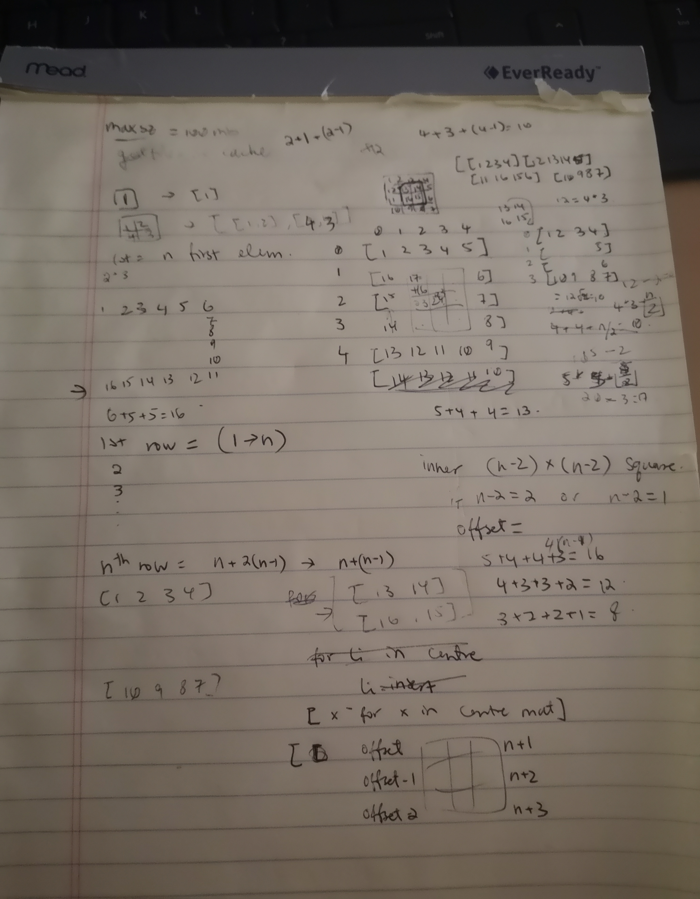

# Advent of Code (2020) and December Leetcode

Code used for the challenges for 2020's [AoC](https://adventofcode.com/2020/).

## Why I'm back

I'm almost graduating soon (yay! but also anxious) and I wanted to apply to jobs "in advance". I know I am hard to motivate, so interview prep is doubly hard (I'm coding during the day, for my last internship, and you tell me I have to code at night as well??). Then I remembered that it was December, and I could do some digestible, fun programming for AoC like I did two years ago to learn Python. I have gotten the chance to work with Python closely this year, but well, a knife dulls when it is not sharpened often (or something).

## Day 1: Report Repair (Dec 6)

### Pre-code

(Part 1) Sounds like a simple task. My gut instinct tells me to first sort the list, and use two pointers, one at the beginning and one at the end, to do summations. We can also jump numbers that way when calculating how much we need to make 2020.

### During code and onto part 2

Wait... how do I Python again? It took me some time to go into it, but I got it. And I forgot there was a second part haha.

Three numbers... I'm pretty sure I've seen this before. Maybe keeping the same approach, and adding a third pointer that moves around may help?

## Day 7: Handy Haversacks and Spiral Matrices

I'll be honest; I saw the string manipulation and possible graph relations and got intimidated. I did know however that I wanted to code something, anything, to progress with my interview prep. LeetCode, ever since lockdown (and maybe before? I never had paid attention...) has a monthly LeetCoding challenge. Today's problem was to generate a list of lists representing a `n` x `n` matrix if it were populated with the numbers from `1` to `n^2` in a spiral manner.

First step: draw examples out. For `n = 1`, we have a simple `[ [1] ]` answer. `n = 2`, `[ [1, 2], [3, 4]]`. Those seem like base cases; a square grid can be broken down to more square grids if we can get the outer spiral numbers in. The first and last rows showed a pattern: the first row is always numbers `1` to `n`, and the last row is also a consecutive, decreasing count from `3n - 2` to `2n - 1`. Surely, there was a mathematical formula to determine the starting number of the inner `n - 2` grid, as well as the leftmost and rightmost elements of each row in that grid.

### Scratchpad notes

The above shows remnants of my process of how I came to [my solution](7/SpiralMatrix.py).

I discussed it with a peer, and their initial sketch was to populate a grid, and to change directions once we "hit a wall" (boundaries of the `n` x `n` grid, or an already populated square). Their approach would have definitely been more straightforward to implement. I believe that the runtimes remained the same though, seeing as both solutions should be in `O(n^2)` (recursion generates the first and last rows of `n` numbers, plus the `n - 2` grid (so `(n - 2)^2`) inside, which ultimately still comes to `n^2` numbers).
